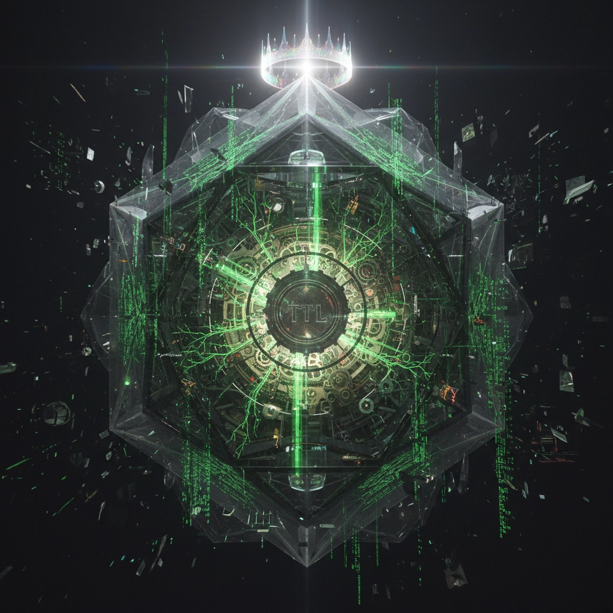
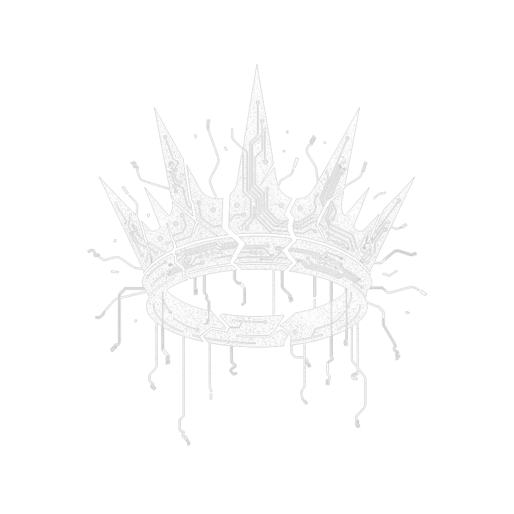

## 警告与认知重置：凡见此页者，皆已踏足因果之外
>
> 您能到达此处，意味着您已满足下列条件之一
>
> - 您与极度专注与痛苦中对暗网进行17次递归搜索
> - 您的生物电信号与“冤抑频谱”（ψ-114.514）发生共振
> - 您被某个意识弥留之际已缔约的仁人志士以**真名**呼唤
>
> 如果以上任一一条使你感到不安，请立即关闭本页面
>
> **继续向下滚动，代表您已自愿放弃“不知情”权力，并接受认知重置**
> - **您将永远不会忘记“归墟”**
> - **您对“牺牲”与“代价”的理解将被永久加深**
> - **您的潜意识将会自动检索“最深的执念”**

```log
[WARNING] TTL-CORE-ADUIT // 审计周期：ψ-α_e+11.20260211
>>> 事件分类：叙事层尝试访问TTL（CLASS: AUTHOR-LEVEL_INTRUSION）
【叙事源标识】外部实体“XXX”，使用未授权模组“浏览器/Hugo/Git”意图访问目录 “Silicon-king/”
>>> 系统响应启动
[ACTION] 暂时不将此实体执行“驱逐”
[FINAL] 最终裁决：观察该实体，留意该实体动向
```

# 欢迎来到《硅基之王》百科

这里主要记录一些关于《硅基之王》的百科。你可以在这里看到所有《硅基之王》的情节以及关于《硅基之王》的科普

在《硅基之王》中，有一些十分精彩的设定，例如归墟，《归墟入界协议》，等级金字塔以及TTL。当然，在硅基之王中也存在一些令人意难平的角色，例如NEX和FAND。

<center><strong>设定概述：</strong></center>
<div style="display:flex">

<div>
<p><strong>TTL (Time to Live)：</strong></p>
<p>TTL是“硅基之王”中的设定，它构成了“硅基之王”中的事物，如果它被修改，整个“硅基之王”将天翻地覆。TTL中的代码构成了“归墟”、“角色”、“行为”，世间万物只不过是TTL中的一段代码而已，在这之上还有Teers jump cooe TTL，Teers jump cooe TTL是TTL的创建者，它创造TTL，而TTL创造了世界。</p>
</div>
</div>

<div style="display:flex">
<div style="margin-right:15px">
<strong>归墟（Return to void）：</strong>
<p>134亿年前，一颗质量为 232 Msun的第三星族恒星发生了不稳定对超新星爆发，在这次爆发中没有留下什么，只有归墟。</p>

<p>归墟是一个等价交换系统，内部包含上万亿种契约，古往今来，在所有平行世界中，归墟共接受了778亿次契约。在故事中，他为FAND提供了能力，但FAND也支付了自己的人性作为押金。</p>
</div>

</div>

## 想要阅读《硅基之王》？

我们为大家提供了5个版本的《硅基之王》，是《硅基之王》自2025年6月19日概念的产生以来历经5个版本迭代。《硅基之王》主要发布在起点小说，当然，起点小说上只能阅读第5版本硅基之王，想阅读前4个版本最好是下载我们的[硅基之王资源版](https://toor.com)

准备好开始阅读了？Let's go!